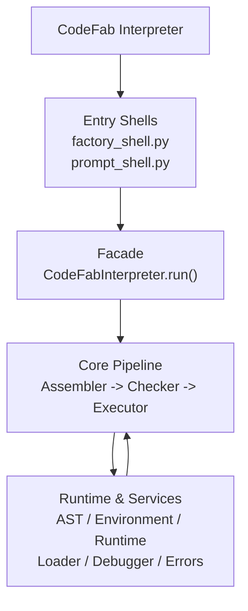
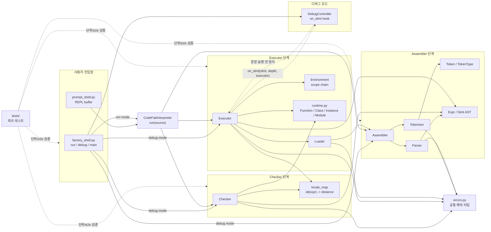
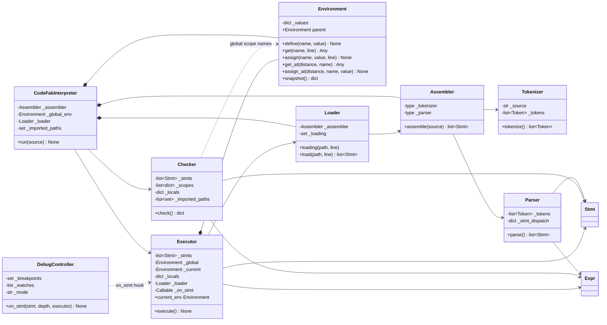
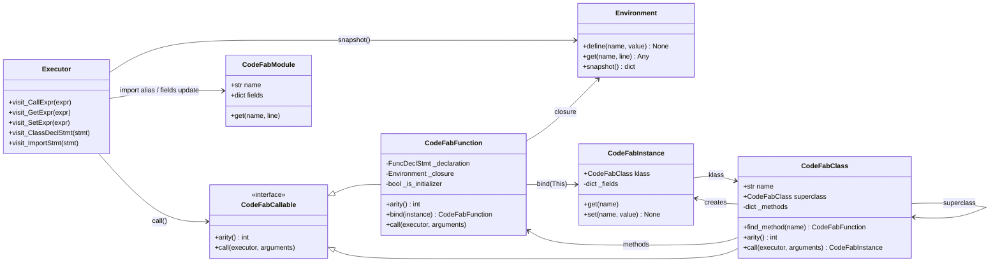
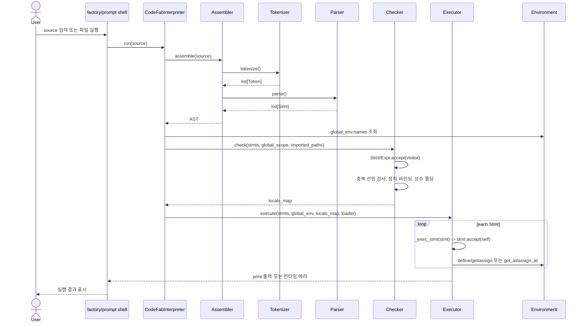
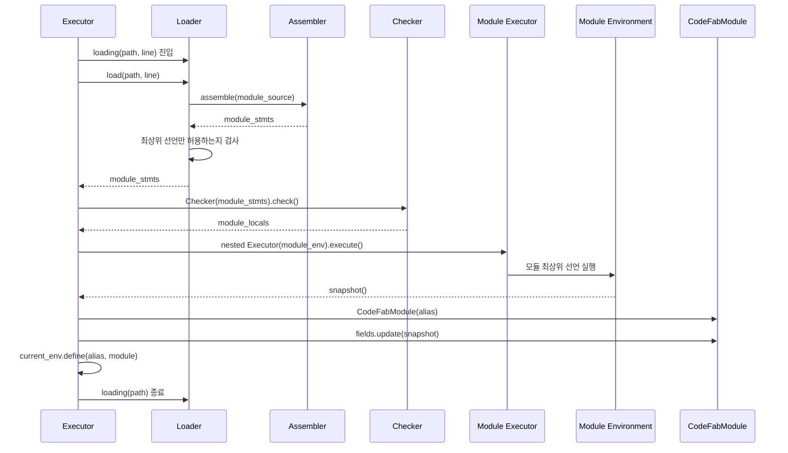
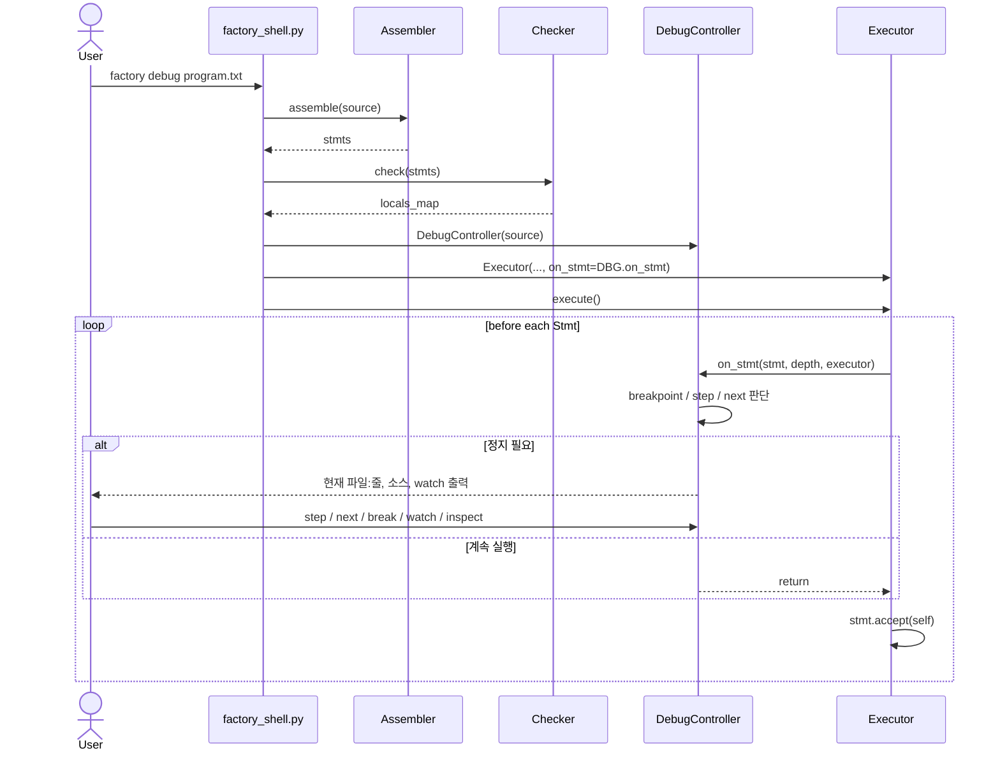

# CodeFab Interpreter 발표 내용 정리

팀: A2 (Approve All, 5팀)

---

## 0. 시작 (Hero)

- **제목**: CodeFab Interpreter
- **한 줄 소개**: Python으로 구현한 미니 스크립트 언어 인터프리터. 소스 코드를 Assembler → Checker → Executor 순서로 처리한다.
- **파이프라인**: `SOURCE.cf → ASSEMBLER → CHECKER → EXECUTOR → OUTPUT`
- **핵심 지표**
    - pytest 699개 전량 통과
    - coverage 100% (`interpreter` 기준 1434 statements, 0 misses)
    - PR 65개 생성(merged 60개, closed 4개, open 1개)
    - commit 212개(`origin/main` 기준)
    - 6인 팀
    - REPL / 디버그 셸 1종

---

## 1. 팀원 소개 및 역할

| 이름  | 역할 | 담당                                                                            |
|-----|----|-------------------------------------------------------------------------------|
| 박준용 | 팀장 | 업무 분배 · Assembler(Parser) Unit · Class · Factory Shell 디버그 모드                 |
| 권은재 | 팀원 | Checker Unit · 실행 전 최적화(정적 바인딩/상수 폴딩) · import                                |
| 김종화 | 팀원 | Assembler(Tokenizer) Unit · Function · AST Visitor 리팩터링 · UT 커버리지 개선          |
| 송지영 | 팀원 | Assembler(Parser) Unit · Class · 테스트 코드 리팩터링                                  |
| 이채연 | 팀원 | Assembler(Tokenizer) Unit · Factory Shell REPL/파일 실행 모드 · Function Checker 로직 |
| 조재현 | 팀원 | Executor Unit · 정적 배열                                                         |

---

## 2. 기능 구현 소개 (구조 설계)

현재 구현 기준으로 보면 CodeFab Interpreter는 `factory_shell.py` / `prompt_shell.py` 진입점 위에
`CodeFabInterpreter` 퍼사드를 두고, 내부에서는 `Assembler → Checker → Executor` 파이프라인을
순서대로 실행하는 구조다. AST는 `Parser`가 만들고, 이후 단계는 Visitor 패턴(`accept(visitor)`)으로
같은 AST를 정적 검사와 실행에 재사용한다.

### 구현 기능 요약

| 기능 영역 | 구현 범위 |
|---|---|
| 기본 문법 · 제어 | ✓ 변수 선언/대입: `var x = 1;`, `x = x + 1;`<br>✓ 기본 타입: Number, String, Boolean, null<br>✓ 산술/비교/동등 연산: `+ - * / %`, `< > <= >=`, `== !=`<br>✓ 논리 연산: `and`, `or`, `!` 및 단락 평가<br>✓ 제어문: `if`/`else`, C 스타일 `for`<br>✓ 블록 스코프와 변수 섀도잉<br>✓ `print` 문과 `//` 한 줄 주석 |
| 함수 · 객체 모델 | ✓ 함수: `Func`, 매개변수, 재귀, 클로저, `return`<br>✓ 클래스: `Class`, 동적 필드, 메서드, `This`, 생성자 `init`<br>✓ 단일 상속: `Class Child : Parent`, `Super`, `instanceof` |
| 데이터 · 모듈 | ✓ 정적 배열: `Array(n)`, `arr[i]` 읽기/쓰기<br>✓ import: `import "path" alias name;` 및 `name.member` 접근 |
| 검증 · 개발자 도구 | ✓ 실행 전 검사/최적화: 중복 선언, 자기 참조, 정적 바인딩, 상수 폴딩<br>✓ Factory Shell 디버그: `step`, `next`, `break`, `watch`, `inspect` |

### 소스코드 구조 한눈에 보기

```text
CodeFab_Interpreter/
├── factory_shell.py          # factory CLI: REPL / 파일 실행 / 디버그 모드 분기
├── prompt_shell.py           # 대화형 REPL, 멀티라인 입력 처리
├── interpreter/
│   ├── codefab.py            # CodeFabInterpreter 퍼사드
│   ├── assembler.py          # source -> tokens -> AST 연결
│   ├── tokenizer.py          # source(str) -> list[Token]
│   ├── tokens.py             # TokenType, Token
│   ├── parser.py             # list[Token] -> list[Stmt]
│   ├── ast_nodes.py          # Expr / Stmt AST 데이터 클래스
│   ├── checker.py            # 정적 검사 + 정적 바인딩 + 상수 폴딩
│   ├── executor.py           # AST 실행, 함수/클래스/import 평가
│   ├── environment.py        # 스코프 체인, get_at/assign_at 최적화 경로
│   ├── runtime.py            # CodeFabFunction/Class/Instance/Module 런타임 값
│   ├── loader.py             # import 대상 파일 로드, 순환 import 탐지
│   ├── debugger.py           # Executor.on_stmt 훅 기반 디버그 컨트롤러
│   └── errors.py             # Tokenize/Parse/Check/Runtime/Import 에러
├── scripts/                  # 발표/재현용 CodeFab 예제
└── tests/                    # tokenizer/parser/checker/executor/e2e 회귀 테스트
```

### 전체 프로젝트 구조 다이어그램



### 모듈 의존 구조



### 핵심 파이프라인 클래스 다이어그램



### AST Visitor 클래스 다이어그램

```mermaid
classDiagram
    direction TB

    class Expr {
        +accept(visitor)
    }
    class Stmt {
        +accept(visitor)
    }

    Expr <|-- LiteralExpr
    Expr <|-- VariableExpr
    Expr <|-- AssignExpr
    Expr <|-- BinaryExpr
    Expr <|-- UnaryExpr
    Expr <|-- GroupingExpr
    Expr <|-- LogicalExpr
    Expr <|-- CallExpr
    Expr <|-- GetExpr
    Expr <|-- SetExpr
    Expr <|-- ThisExpr
    Expr <|-- SuperExpr
    Expr <|-- InstanceOfExpr
    Expr <|-- ArrayExpr
    Expr <|-- IndexGetExpr
    Expr <|-- IndexSetExpr

    Stmt <|-- ExpressionStmt
    Stmt <|-- PrintStmt
    Stmt <|-- VarDeclStmt
    Stmt <|-- BlockStmt
    Stmt <|-- IfStmt
    Stmt <|-- ForStmt
    Stmt <|-- FuncDeclStmt
    Stmt <|-- ReturnStmt
    Stmt <|-- ClassDeclStmt
    Stmt <|-- ImportStmt

    class Parser {
        +parse() list~Stmt~
    }
    class Checker {
        +visit_BinaryExpr(expr)
        +visit_VarDeclStmt(stmt)
        +visit_ClassDeclStmt(stmt)
        +visit_ImportStmt(stmt)
    }
    class Executor {
        +visit_BinaryExpr(expr)
        +visit_VarDeclStmt(stmt)
        +visit_ClassDeclStmt(stmt)
        +visit_ImportStmt(stmt)
    }

    Parser --> Expr : creates
    Parser --> Stmt : creates
    Checker ..> Expr : visit_XxxExpr
    Checker ..> Stmt : visit_XxxStmt
    Executor ..> Expr : visit_XxxExpr
    Executor ..> Stmt : visit_XxxStmt
```



### 런타임 객체 모델 클래스 다이어그램



### 일반 실행 시퀀스



### import 실행 시퀀스



### 디버그 모드 시퀀스



CodeFab 소스는 아래 4단계를 순서대로 거친다.

### STEP 1. Assembler

- 관련 파일: `tokenizer.py`, `parser.py`, `ast_nodes.py`
- 소스 문자열 → 토큰(Tokenizer) → AST 문장 목록(Parser)
- 변수·제어문·함수·클래스·정적 배열 문법 정의

### STEP 2. Checker

- 관련 파일: `checker.py`, `environment.py`
- 실행 전 정적 검사(중복 선언, 자기 참조)
- 정적 바인딩, 상수 폴딩 — 런타임 이전에 오류를 잡고 반복 연산을 미리 계산

### STEP 3. Executor

- 관련 파일: `executor.py`, `runtime.py`, `loader.py`
- AST 실제 실행: 함수/클로저/클래스/상속/정적 배열/import

### STEP 4. Factory Shell

- 관련 파일: `debugger.py`, `factory_shell.py`, `prompt_shell.py`
- REPL, 파일 실행, `step / next / break / watch / inspect` 문장 단위 디버그 모드

### 추가 기능 구현 체크리스트

- [x] function 관련 요구사항
- [x] class 관련 요구사항
- [x] 정적 배열 구현
- [x] 실행 전 최적화
- [x] import 관련 요구사항
- [x] 공장 제어 쉘 제작

### SOLID 원칙 적용 요소

CodeFab Interpreter는 작은 모듈들이 `source → AST → 검사 결과 → 실행 결과`라는 흐름 안에서
각자 한 가지 책임을 맡도록 나뉘어 있다. 발표에서는 “SOLID를 의식해서 거창한 프레임워크를
만든 것”보다는, 요구사항이 늘어날 때 변경 범위를 줄이기 위해 자연스럽게 적용한 설계 원칙으로
설명하는 것이 좋다.

| 원칙 | 코드 적용 지점 | 발표 포인트 |
|---|---|---|
| SRP<br/>단일 책임 원칙 | `Tokenizer`, `Parser`, `Checker`, `Executor`, `Loader`, `Environment`, `DebugController` | 토큰화, AST 생성, 정적 검사/최적화, 실행, import 로딩, 스코프 관리, 디버깅 제어가 분리되어 있어 오류가 난 단계와 수정할 파일을 좁히기 쉽다. |
| OCP<br/>개방-폐쇄 원칙 | `Expr.accept(visitor)`, `Stmt.accept(visitor)`, `Checker.visit_Xxx`, `Executor.visit_Xxx` | AST 노드가 늘어나면 기존 순회 루프를 크게 고치지 않고 새 노드와 방문 메서드를 추가하는 방식으로 확장한다. `accept()`가 `visit_Xxx` 누락을 즉시 실패시키므로 확장 실수도 빨리 드러난다. |
| LSP<br/>리스코프 치환 원칙 | `CodeFabCallable`을 구현하는 `CodeFabFunction`, `CodeFabClass` | `Executor.visit_CallExpr()`는 호출 대상이 함수인지 클래스인지 구분해 분기하지 않고 `arity()`와 `call()`만 사용한다. 클래스도 생성자처럼 호출 가능하므로 함수 호출 문법과 같은 실행 경로를 공유한다. |
| ISP<br/>인터페이스 분리 원칙 | `CodeFabCallable`의 `arity()` / `call()` 최소 인터페이스, `Executor.on_stmt` 콜백 | 호출 가능한 런타임 값은 호출에 필요한 메서드만 요구하고, 디버거는 Executor 전체 구현을 상속하지 않고 문장 실행 전 훅만 제공한다. 필요한 접점이 작아 테스트와 교체가 쉽다. |
| DIP<br/>의존성 역전 원칙 | `Assembler(tokenizer=..., parser=...)`, `Executor(loader=..., on_stmt=...)`, `CodeFabInterpreter` 파이프라인 조립 | 상위 흐름은 구체 구현을 직접 하드코딩하기보다 생성자 주입으로 조립된다. 테스트에서는 가짜 Tokenizer/Parser/Loader나 `on_stmt` spy를 넣어 파이프라인과 디버그 동작을 독립적으로 검증할 수 있다. |

### 적용된 디자인 패턴

| 패턴 | 코드 적용 지점 | 역할 |
|---|---|---|
| Facade | `CodeFabInterpreter.run(source)` | 사용자는 `run()` 하나만 호출하면 되고, 내부의 `Assembler → Checker → Executor` 세부 흐름은 퍼사드가 조립한다. REPL도 이 퍼사드를 재사용해 전역 환경을 유지한다. |
| Visitor / Double Dispatch | `Expr.accept()`, `Stmt.accept()`, `Checker`, `Executor` | 같은 AST를 정적 검사와 실행에 재사용한다. 노드 타입별 로직은 `visit_Xxx` 메서드로 모여 있어 새 분석기나 출력기를 추가하기 쉽다. |
| Strategy / Callback Hook | `Executor(on_stmt=DebugController.on_stmt)` | 실행기는 “문장 실행 전 무엇을 할지”를 콜백으로 위임한다. 일반 실행에서는 훅이 없고, 디버그 모드에서는 같은 Executor에 `step/next/break/watch` 전략을 주입한다. |

### SOLID와 패턴이 요구사항 변경에 준 효과

- `import` 기능 추가 시: `Loader`가 파일 로드와 순환 import 탐지를 맡고, `Executor.visit_ImportStmt()`가 모듈 실행과 네임스페이스 생성을 맡아 기존 함수/클래스 실행 로직과 충돌을 줄였다.
- `debug next` 개선 시: Executor는 `on_stmt` 훅과 depth만 제공하고, 정지 여부 판단은 `DebugController`에 남겨 실행 로직 수정 범위를 줄였다.
- `상수 폴딩` 추가 시: Checker 단계에 최적화를 넣고, 실제 이항 연산 의미는 `runtime.eval_binary_op()`로 공유해 Checker와 Executor의 계산 규칙 중복을 줄였다.
- `This/Super` 정적 바인딩 보완 시: Checker가 `locals_map`을 계산하고 Executor가 `get_at()`/`assign_at()`을 사용하는 구조라, 스코프 탐색 최적화를 실행 단계와 분리해서 확장할 수 있었다.

---

## 3. BP 사례

실제 PR/커밋에서 확인한 Code Review, TDD, Refactoring, 사용성 개선 사례입니다.

### 3-1. Code Review — 클래스명 중복 선언 검출 누락

- 리뷰 중 `Class Robot`이 기존 변수 `Robot`을 조용히 덮어쓰는 문제를 재현 코드로 발견
- 원인: Checker가 클래스명을 스코프에 등록하지 않음
- 수정: `visit_ClassDeclStmt()`에서 이름을 스코프에 선언 등록
- 결과: `CheckError`로 중복 선언을 실행 전에 차단하고 회귀 테스트로 보장

### 3-2. TDD — modulo 상수 폴딩 누락

- 문제: PDF 예시의 `%` 리터럴 연산이 매 반복마다 재계산됨
- 실패하는 회귀 테스트(`test_modulo_constant_folding`)를 먼저 작성 → `Checker._try_fold_binary()` 수정
- 주의: `% 0`처럼 런타임 에러가 유지되어야 하는 식은 폴딩하지 않음
- 결과: 루프 내부 상수식을 실행 전에 접어 불필요한 런타임 연산 제거

### 3-3. Refactoring — eval_binary_op 추출

- 문제: `checker.py`(상수 폴딩)와 `executor.py`(실행)에 11개 이항 연산자 처리 로직이 중복
- 수정: `runtime.eval_binary_op()` 한 곳으로 통합
- 효과: 연산 의미가 바뀌어도 한 곳만 수정하면 Checker와 Executor 동작이 함께 맞춰짐
- 검증: 기존 테스트 전량 통과로 동작 동일성 확인

### 3-4. Error UX — import 오류 traceback 노출 방지

- 문제: 파일 실행 · 디버그 · REPL 세 경로에서 `ModuleImportError`가 사용자에게 traceback으로 노출됨
- 수정: 세 진입점(`factory_shell.py`, `prompt_shell.py`) 모두 메시지 출력 + 종료 코드 1로 통일
- 결과: 누락 import 시 traceback 없이 오류 메시지만 출력되도록 회귀 테스트 추가

### 3-5. Debug UX — `next`가 복합문 내부에서 다시 멈추는 문제

- 근거: PR #54 / 커밋 `3a3240b`
- 문제: 디버그 모드에서 `for`/`if` 같은 복합문에 `next`를 실행하면 내부 Stmt에서 다시 멈춰 `step`과 `next`의 의미가 섞임
- 수정: 중첩 Stmt 실행 helper로 debug depth를 분리하고, import된 모듈 실행도 호출 지점보다 깊은 depth로 처리
- 검증: `next`가 루프 본문 내부에서 다시 멈추지 않는 회귀 테스트와 수동 재현 스크립트 추가

### 3-6. Code Review — REPL 재import 우회 버그와 문서 정확성

- 근거: PR #53 / 커밋 `d4e51de`
- 문제: `CodeFabInterpreter.run()`마다 새 `Checker`가 만들어져 import 경로 기록이 초기화되고, 같은 파일을 다른 alias로 다시 import할 수 있었음
- 수정: Interpreter 인스턴스가 `_imported_paths`를 보존해 Checker에 전달하고, 블록 스코프 재import 허용과 인스턴스 간 독립성은 회귀 테스트로 보장
- 문서 개선: 실제 구현은 O(depth) + 해시 조회인데 README/주석에 O(1)로 적힌 표현을 정확하게 정정
- 검증: 재import 버그를 먼저 재현한 뒤 수정하고, 스코프 규칙이 깨지지 않음을 테스트로 확인

### 3-7. Refactoring — AST Visitor 패턴 전환

- 근거: PR #47 / 커밋 `b1d2afa`, `4b51cb4`, `1171de6`
- 문제: Checker/Executor의 dict 기반 AST handler는 새 노드 handler 등록 누락이 늦게 드러날 수 있음
- 수정: `Expr.accept(visitor)`, `Stmt.accept(visitor)` 더블 디스패치로 통일하고 `visit_Xxx` 누락 시 즉시 실패하도록 변경
- 검증: Visitor 동작, 확장성, 미등록 노드 즉시 실패를 검증하는 전용 테스트 추가
- 발표 포인트: 리팩터링 중 merge conflict로 Executor Stmt 디스패치가 깨진 것을 복구하며, 구조 변경에는 회귀 테스트와 병합 후 검증이 필요함을 확인

### 3-8. Refactoring — 테스트 공통 헬퍼와 fixture 추출

- 근거: PR #41 / 커밋 `f8d40c6`
- 문제: 여러 테스트 파일에 `tok`, `name_tok`, `path_tok`, 임시 파일 생성 helper가 반복되고, 함수 인자 개수 테스트도 중복 케이스가 많았음
- 수정: `tests/helpers.py`, `tests/conftest.py`의 `tmp_write` fixture로 공통화하고, 유사 케이스는 `pytest.mark.parametrize`로 통합
- 효과: 테스트 의미는 유지하면서 중복을 줄여 이후 기능 추가 시 테스트 작성 비용 감소
- 검증: 기존 테스트 전량 통과

### 3-9. TDD + Optimization — `This` 정적 바인딩 누락 보완

- 근거: PR #40 / 커밋 `32e6d55`
- 문제: `Super`는 정적 바인딩이 적용됐지만 `This`는 매번 동적 `Environment.get` 조회를 타고 있어 클래스 메서드의 빈번한 접근 경로에 최적화 공백이 있었음
- 수정: Checker가 `This`도 `_resolve_local()`로 distance를 계산하고, Executor는 distance가 있으면 `get_at()`으로 접근
- 검증: 상속 여부와 무관하게 distance가 유지되는지 확인하고, Test Double spy로 동적 조회가 사라졌는지 검증

### 3-10. TDD + Coverage — 미커버 라인 보강 중 숨은 회귀 발견

- 근거: PR #59, PR #62(진행 중) / 커밋 `403ae6e`, `37bc9ed`, `69fe567`, `41052ea`, `db8082b`
- 문제: tokenizer/parser/checker/executor/runtime의 미커버 라인을 보강하는 과정에서 main 병합 conflict와 `_try_fold_binary`의 회귀 가능성을 발견
- 수정: 음수/비정수 배열 크기, 비정수 배열 인덱스, `var` 없는 for 초기화식, runtime 문자열 표현 등 경계 테스트 추가
- 추가 수정: 처리하지 않는 연산자를 `LiteralExpr(None)`으로 잘못 접거나, 비교 중 `TypeError`가 Checker 밖으로 새는 문제 방지
- 검증: pytest 699개 전량 통과, `interpreter` 패키지 coverage 100% 달성(1434 statements, 0 misses)
- 발표 포인트: 커버리지 보강이 단순 수치 개선을 넘어 숨은 회귀를 드러내는 안전망 역할을 함

---

## 4. 프로젝트 시연

전체 코드와 테스트 699개 기준으로 정상 흐름을 먼저 보여주고,
최근 보완 사항이 만든 경계 조건을 이어서 검증한다.

### 4-1. 시연 로드맵

#### 기본 기능 시연

| 순서 | 시연 항목 | 실행/입력 | 기대 결과 | 확인 포인트 |
|---:|---|---|---|---|
| 1 | REPL / 멀티라인 입력 | `python factory_shell.py` | `2`, `ok` 출력 | REPL 버퍼가 블록 종료까지 기다리고 전역 환경을 유지 |
| 2 | Function | `python factory_shell.py run scripts/function_demo.txt` | `10`, `120`, `Hello, CodeFab!` | 인자, `return`, 재귀, 문자열 연결 |
| 3 | Class | `python factory_shell.py run scripts/class_test.txt` | `5` 출력 | `This` 기반 필드 갱신과 메서드 호출 |
| 4 | Class 확장 예시 | README의 `SpeedRobot : Robot` 예제 | `Speeeed!`, `15`, `true` | `Super`, `init`, `instanceof` |
| 5 | Import | `python factory_shell.py run scripts/import_demo.txt` | `3` 출력 | 독립 모듈 환경, alias, `sum.add(1, 2)` 멤버 접근 |
| 6 | Debug Shell | `python factory_shell.py debug scripts/debug_next_for_repro.txt` | `next` 후 for 본문 내부 정지 없이 4번째 줄에서 정지 | `step`/`next` depth 차이 |

#### 엣지 케이스 시연

| 순서 | 시연 항목 | 실행/입력 | 기대 결과 | 확인 기준 |
|---:|---|---|---|---|
| 1 | 클래스명 중복 선언 | `python factory_shell.py run scripts/class_name_collision_repro.txt` | `[7번째줄] 변수 'Robot'... 이미 이 스코프에 선언` | `test_class_name_colliding_with_existing_variable_raises` |
| 2 | 배열 범위 밖 접근 | `var arr = Array(2); arr[2] = 9;` | `[2번째줄] 배열 인덱스가 범위를 벗어났습니다.` | 배열 경계 테스트 |
| 3 | 배열 크기/인덱스 타입 | `Array(2.5)`, `arr[1.5]`, `"x"[0]` | 크기/인덱스 타입 오류 | `tests/test_executor.py` 배열 오류 케이스 |
| 4 | 누락 import 오류 UX | `python factory_shell.py run scripts/missing_import_error_demo.txt` | traceback 없이 한 줄 오류 | import 오류 UX 테스트 |
| 5 | 재import / 순환 import | 같은 파일을 다른 alias로 재import, A→B→A import | `CheckError` 또는 `ModuleImportError` | `tests/test_executor_import.py` |
| 6 | `for` 내부 import 금지 | `for (...) { import "..."; }` | `ParseError` | parser import depth 테스트 |
| 7 | 상수 폴딩 안전장치 | `print 10 % 3; print 10 % 0;` | `1` 출력 후 `[2번째줄] 0으로 나눈 오류` | 상수 폴딩 회귀 테스트 |
| 8 | 정적 스코프 키워드 오류 | `return 1;`, 클래스 밖 `This`, 부모 없는 `Super` | 실행 전 `CheckError` | `tests/test_checker.py` |
| 9 | Debug `next` 회귀 | `debug_next_for_repro.txt`에서 `step`/`next` 비교 | `next`는 복합문 내부에서 다시 멈추지 않음 | debug `next` 회귀 테스트 |

### 4-2. REPL 기본 예시

준비된 REPL 예시:

```text
>> var a = 1;
>> print a + 1;
2
>> if (true) {
...   print "ok";
... }
ok
```

### 4-3. 발표 시간별 추천 선택

- **3분 데모**: REPL → Function → Class → Import → Debug `next`
- **5분 데모**: 3분 데모 + 클래스명 중복 선언 + 누락 import 오류 UX
- **8분 데모**: 5분 데모 + 배열 범위 오류 + `% 0` 상수 폴딩 안전장치 + REPL 재import

---

## 5. 소감

- **박준용**: 추후 작성 예정
- **권은재**: TDD로 Checker를 만들다 보니 테스트를 먼저 정해두는 게 이후 기능이 추가될 때도 회귀를 잡아주는 안전장치가 된다는 걸 실감했습니다. 리뷰는 통과 여부만 보는 게 아니라 왜 그렇게 동작하는지까지 확인하는 작업이라는 걸 다시 배웠습니다.
- **김종화**: 처음부터 끝까지 TDD를 적용해보며 모든 변경점이 UT로 검증되는 안심감을 느꼈습니다. 앞으로 현업에서도 UT 작성을 꾸준히 해야겠다고 생각했습니다.
- **송지영**: 혼자 개발할 땐 크게 느끼지 못했던 클린코드·TDD의 필요성을, 팀원의 코드를 이해하고 수정하면서 체감했습니다. 언젠가 다른 사람이 볼 코드를 고려해 테스트와 리팩토링을 잘 해둬야겠습니다.
- **이채연**: 같은 설계 문서를 공유하면 Claude 사용이 협업에 유리하다고 느꼈습니다. 모듈을 나눠 독립적으로 개발해도 꼼꼼한 테스트 케이스 덕분에 서로의 변경이 깨지지 않는지 쉽게 검증할 수 있었습니다.
- **조재현**: 현업에서 어려웠던 코드 충돌·역할 분담이 이번엔 체계적으로 진행됐습니다. 브랜치별 PR로 개발 흐름이 잡혔고, 시간이 걸리더라도 코드 리뷰 문화를 도입하고 싶다는 생각이 들었습니다.

---

## 6. 마무리

- A2 · Approve All · 5팀
- Assembler → Checker → Executor → Factory Shell
- PR 65개 · commit 212개 · pytest 699개 · coverage 100% · 6명
